<h1 style="text-align: center"> 车道线检测 （Lane Detection）</h1>

## 1、实验内容

本实验使用数字图像处理的基本方法，构建了一个车道线检测模型。该模型可以识别图像中所有的车道线，并得到完整的车道线信息。模型在tuSimple Lane Dataset大小为100的数据子集进行了测试，达到了较好的结果。

## 2、实现思路

实现车道线检测，主要包含两部分操作

1. 道路图像的处理，主要包括灰度图转换、基于高斯平滑的图像去噪、基于Canny算法的边缘提取
2. 车道线检测方法，主要包括获取感兴趣区域（ROI）、形态学闭运算、基于Hough变换的直线检测

模型的处理流程如下，

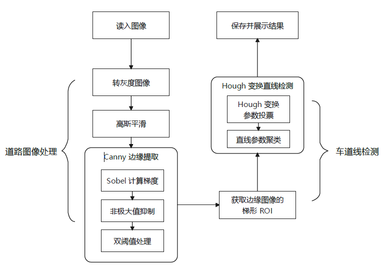

### 2.1 道路图像处理

通过对道路图像进行处理，突出图像中的车道线部分。模型将彩色图像转化成灰度图像进行处理，目的是简化模型的复杂度，提高运行效率。

#### 2.1.1 高斯平滑

由于光照、路面情况、拍摄质量等问题，道路图像上存在很多噪声，通过高斯滤波使图像变得平滑，减弱图像中的噪声对结果的影响，提高车道线检测模型的鲁棒性。

高斯平滑就是使用高斯滤波器与原图像进行卷积，得到平滑图像。与均值滤波类似，它们都是取滤波器窗口内像素的加权均值作为输出。高斯滤波器的权值分布满足二维高斯函数。
$$
h(x,y) = e^{-\frac{x^2+y^2}{2\sigma^2}} \quad  (x,y) 为二维平面坐标系中点的坐标
$$
由于高斯平滑是线性离散滤波，因此离散形式的高斯滤波器为
$$
H_{i,j} = \frac{1}{2 \pi \sigma ^ 2}e ^{-\frac{(i - k - 1)^2 + (j - k - 1)^2}{2 \sigma ^ 2}} \quad 窗口的长宽均为 (2\times k + 1)
$$
本实验采用 $3\times3$ 的高斯滤波器。具体实现为定义 `Kernel` 类实现通用的卷积操作，定义派生类 `GaussianKernel` 实现不同 size 和 $\sigma$ 高斯滤波器的构建的运算，实现接口如下：

```c++
/* Kernel.h */
class Kernel
{
public:
    double **data;
    int size;
    Kernel(int size);   // 空的卷积核
    Kernel(Kernel &cp); // 拷贝构造函数
    ~Kernel();
    double *operator[](const int idx) const;
    // 卷积操作
    template<typename T1, typename T2>
    void convolve(const Img<T1> &src, Img<T2> &dst, const bool is_clip = true) const;
};

class GaussianKernel : public Kernel
{
public:
    double sigma;
    GaussianKernel(const int size, const double sigma);
    GaussianKernel(GaussianKernel &cp);
};
```

#### 2.1.2 边缘提取

在实验过程中，我曾尝试采用以下方法进行边缘提取的方法。由于在图像中车道线的灰度值较大，因此我设计了一种参数自适应的阈值分割算法，把车道线从图像中抽取出来。具体方法如下：统计图像的灰度分布，选取整体灰度分布相应比例对应的灰度值作为阈值，对图像进行二值化。效果如下：

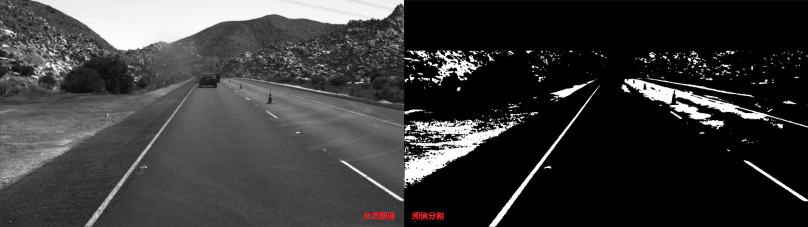

可以发现，通过阈值分割有效的过滤掉了大部分背景，如山脉、路面、车辆，这为下面的直线检测去除了一定的干扰。但是由于部分图像存在反光或较亮区域，这导致一些车道线丢失，或特征不再明显，如下图。

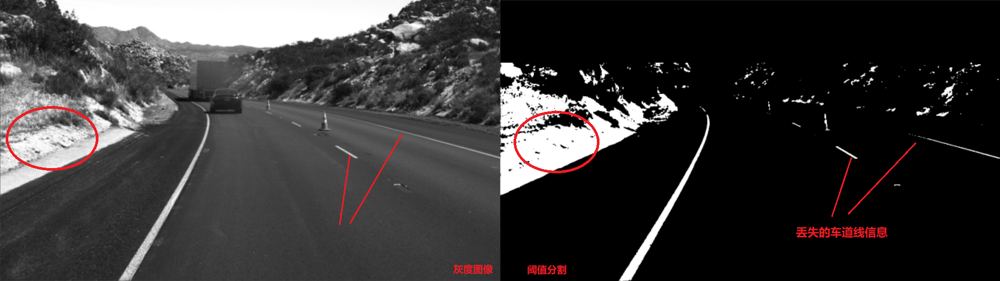

虽然可以通过求图像梯度的方法将大面积的高亮度区域滤除，但是直接将原图转成二值图像处理，会丢失车道线的细节信息导致结果车道线信息不完整。因此舍弃该方案。

最终采用基于图像梯度的边缘提取方法——Canny算法。Canny主要包含三个步骤：

1. Sobel算子：计算图像梯度
2. 非极大值抑制：去除非边缘的噪点，细化边缘
3. 双阈值：检测并连接边缘

（1）Sobel 算子计算图像梯度

灰度图可以看做灰度值 $h(x,y)$ 关于 $(x,y)$ 坐标的二元函数，计算图像梯度可以通过Sobel算子计算得到。​

* $x$ 方向梯度： ${grad}_x(x,y) = \frac{\partial h(x,y)}{\partial x}$
* $y$ 方向梯度： ${grad}_y(x,y) = \frac{\partial h(x,y)}{\partial x}$
* 梯度幅度： $grad = \sqrt{{grad_x}^2 + {gard_y}^2}$
* 梯度方向：$gard_\theta = arctan(\frac{grad_y}{grad_x})$

其中计算 $x,y$ 方向的梯度使用Sobel算子对图像进行卷积
$$
grad_x = \begin{bmatrix} -1 & 0 & 1 \\ -2 & 0 & 2 \\ -1 & 0 & 1 \end{bmatrix} \times img \quad
grad_y = \begin{bmatrix} 1 & 2 & 1 \\ 0 & 0 & 0 \\ -1 & -2 & -1 \end{bmatrix} \times img
$$
Sobel 算子计算梯度效果如下：

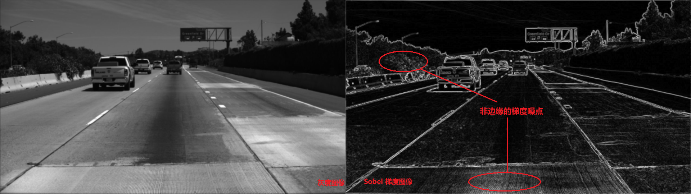

（2）非极大值抑制

分析上图发现，由于图像灰度存在起伏，所以有一些不是边缘的区域也存在较大的梯度。采用非极大值抑制（NMS）的方法，消除梯度图像中非边缘的噪声，并将边缘细化。

NMS实现的思路如下：计算每个中心像素点沿梯度方向邻域内各点的梯度值，如果该中心像素点的梯度值是以上像素点梯度值的局部极大值，则保留梯度，否则梯度置为零。由于邻域内在梯度方向上的点不一定是在整数坐标位置，因此需要通过插值计算邻域内梯度方向点的梯度值。实现效果如下：

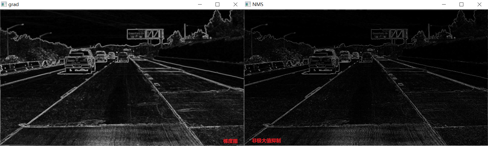

一些非边缘的噪点得到了一定程度的抑制，边缘也得到细化。

（3）双阈值检测和边缘连接

需要将得到的梯度图像进行阈值分割，得到二值图以便后续进行hough变换。采用双阈值对图像进行阈值分割，实现思路如下：

* 当梯度值大于高阈值时，将其灰度值取为255。
* 当梯度值小于低阈值时，将其灰度值取为0。
* 当梯度介于两者之间是，如果该点邻域内有高阈值点，则取为255，否则取0。

双阈值处理中，高阈值将物体边缘和背景区分开，但是当高阈值较大时，可能导致边缘断断续续；此时低阈值平滑边缘轮廓，能实现较好的分割效果。同时借鉴之前尝试对灰度图做阈值分割的思路，采用整体灰度分布相应比例处的灰度值为高阈值，低阈值取高阈值的 $\frac{2}{3}$，实现效果如下：

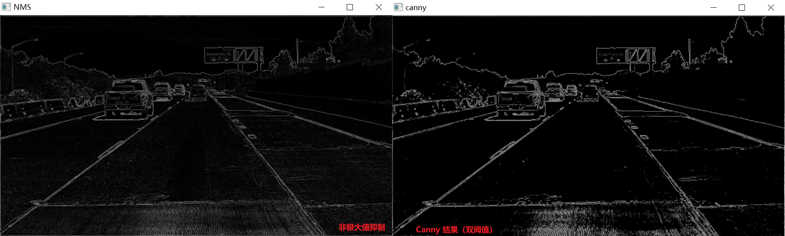

Canny 边缘提取的实现接口如下：

```c++
#ifndef LANE_DETECTION_EDGE_DETECTION_H
#define LANE_DETECTION_EDGE_DETECTION_H

#include "Img.hpp"
#include "Kernel.h"
// 阈值分割
void TurnBinary(Img<uchar> &src, const double weight);
// 膨胀运算
void Dilation(const Img<uchar> &src, Img<uchar> &dst, int kernel_size);
// 腐蚀运算
void Erosion(const Img<uchar> &src, Img<uchar> &dst, int kernel_size);
// 遮盖无效部分
void RoiMask(Img<uchar> &src);
// Sobel 算子计算梯度
void Sobel(const Img<uchar> &src, Img<uchar> &dst, Img<double> &theta);
// 非极大值抑制
void NonMaxSuppression(const Img<uchar> &src, Img<uchar> &dst, const Img<double> &theta);
// 双阈值处理
void DoubleThreshold(Img<uchar> &image, const double weight = 0.9);
// Canny 边缘检测
void Canny(Img<uchar> &image, const double weight = 0.9);
#endif //LANE_DETECTION_EDGE_DETECTION_H
```

### 2.2 车道线检测

#### 2.2.1 梯形 ROI mask

经过图像的边缘提取，车道线边缘已经从图像中抽取出来。观察边缘图像发现：道路两边的环境复杂，存在很多干扰车道线检测的直线边缘，如天际线、山脉边缘、电线杆、树丛等。同时考虑到道路图像中，车道线集中在图像的中间偏下区域，因此可以仅对感兴趣区域(ROI)进行处理和检测。根据车道线图像特点，采用梯形掩码获取ROI。

观察图像选取了(400, 0) (220, 420) (200, 860), (400, 1280)四个点作为 mask 的角点。mask图像如下

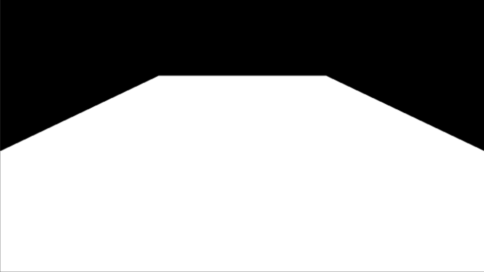

ROI 如下：

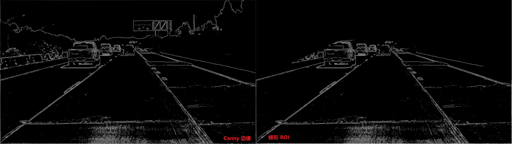

#### 2.2.2 hough 变换检测直线

hough变换是一种目标检测的方法，可以检测出有明确表达式的图形。hough 变换的基本原理：利用两个不同坐标系之间的变换来检测图像中的直线。将图像空间中的直线映射到参数空间的一个点，然后对参数空间中的点进行累计投票，进而得到参数空间中的峰值点，该峰值点就对应空间坐标系中的真实存在的直线参数。

hough变换中，直线采用极坐标方程表示，因为参数$\theta$ 和 $r$ 的范围有限，便于以相同步长进行离散化

实现思路：

* 初始化参数空间（二维矩阵）
* 遍历空间坐标系的每个非零像素点，为所有可能经过该点的直线的参数进行投票。
* 找出参数空间中大于指定阈值的参数点

hough 变换效果如下图：

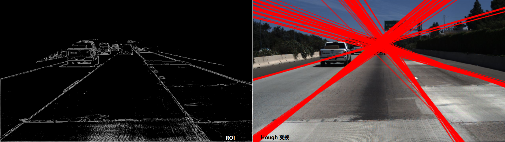

可以线由于车道线存在一定的弧度并非严格地直线，且存在一定宽度，导致每条车道线都会检测出多条对应直线。可以采用聚类的方法对检测出的直线进行聚类，以得到更精准的效果。

#### 2.2.3 车道线聚类

由于 k-means 等聚类算法复杂度较高，影响车道线检测的实时性。所以我设计了一种高效的聚类方案。具体思路如下：根据以两个直线的角度参数距离为相似度函数，遍历hough变换检测出的所有直线参数，如果相似度高于阈值，则认为属于同一类别，该类别大小加一；如果相似度低于阈值，则认为属于不同类别，与下一个类中心点进行比较。如果没有相似的

伪代码如下：

```c++
params; 	// hough 变换得到参数列表
clusters; 	// 聚类列表
flag; 		// 标记是否新建类
for param in params
{
    flag = true;
    for cluster in clusters
    {
		if is_similar(param, cluster)	// 如果相似则添加到该类中
        {
            flag = false;
            update(cluster);
            break;
        }
    }
    if flag	// 与现有的所有类都不同
        clusters.append(param);	// 添加新类
}
```

这里相似度函数采用两条直线的角度参数的差值。

一开始选择的更新聚类中心的方法，是取同一类别的平均值，效果不佳。经过尝试最后采用取每个类别的初始值为中心点，实现较好的效果。示例如下：

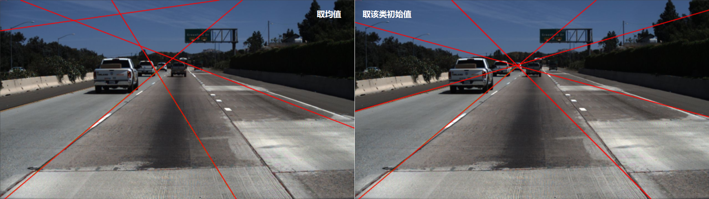

评测结果对比：

| 中心点     | Accuracy | FP     | FN     |
| ---------- | -------- | ------ | ------ |
| 数据均值   | 0.5740   | 0.7058 | 0.7533 |
| 聚类初始值 | 0.7539   | 0.5025 | 0.5242 |

分析原因：由于车道线有一定弧度，导致前半部分和后半部分的车道线参数差距较大。如果降低判定相似的标准，就会导致本不相似的直线求均值，从而使Accuracy较低；如果提高相似的标准就会，导致聚类得到类别很多，从而FP较大；因此采用加权均值更新聚类中心点并不理想。

按照车道线聚类结果中每个类别的大小，对聚类结果进行排序，选择所有聚类结果中规模最大的4个类作为最终确定的直线参数。

代码接口如下：

```c++
// 相似函数
bool is_similar(pair<int, int> &l1, pair<int, int> &l2);
// 更新类中心点
void update_cluster(pair<int, int> &line, pair<pair<int, int>, int> &cluster);
// 直线聚类
void lines_cluster(vector<pair<int, int>> &lines);
// hough变换
void HoughTransform(Img<uchar> &src, vector<pair<int, int>> &lines, int threshold);
```

### 2.3 输出结果

函数接口如下：

```c++
/* 根据车道线的参数，获取坐标向量 */
void GetLanes(Img<uchar> &src, vector<pair<int, int>> &params, vector<vector<int>> &lanes);
/* 将检测结果写入json文件 */
void WriteJson(string &raw_file, vector<vector<int>> &lanes, double run_time, ofstream &of);
/* 展示车道线检测结果 */
void polyLanes(const string &path, vector<vector<int>> &lanes, int delay);
```

通过 `GetLanes` 将每个直线参数转换成直线坐标，`WriteJson` 函数将结果写入json文件，`polyLanes` 可视化展示车道线。

实现效果如下：

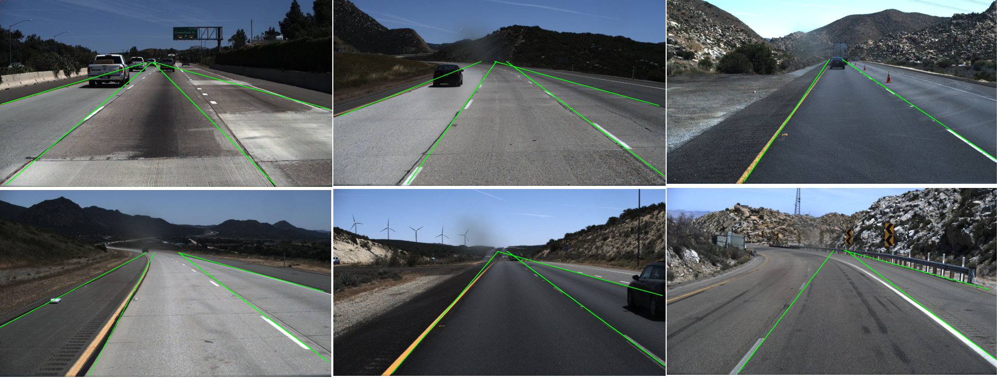

## 3、 实现说明

### 3.1 Img 模板类存储图像

由于只允许使用OpenCV进行图像的读写操作，因此本实验构建了 `Img` 模板类，作为图像存储和操作的基本数据结构，代码接口如下：

```c++
template<typename T>
class Img
{
public:
    T **data;   // 存放数据
    int rows;   // 图像的行数
    int cols;   // 图像的列数

    Img(int rows, int cols); /* 构造空值图像 */
    Img(const char *path);   /* 读入图像：灰度图 */
    Img(Img &cp);            /* Img类的复制构造函数 */
    ~Img();

    T *operator[](const int idx) const;
    Img &operator=(const Img &cp);

    cv::Mat toMat() const;                        /* 将图像转换成 cv::Mat */
    void show(const char *name, int delay) const; /* 展示图片 */
};
```

展示图片的`plotLanes`函数也使用了 OpenCV 框架对图像进行展示。

### 3.2 main 函数

```c++
int main()
{
    // 获取所有图片的路径
    vector<string> file_names;
    get_image_names("../data/selected test data", file_names);
    // 输出文件流接口
    ofstream out;
    out.open("../result/predict.json", ios::out);
    // 记录 run_time 运行时间
    clock_t begin_time, end_time;
    // 车道线检测
    for (auto &path : file_names)
    {
        begin_time = clock();
        Img<uchar> src(path.data());
        Img<uchar> dst(src.rows, src.cols);
        Img<uchar> dst_close(src.rows, src.cols);
        Img<double> theta(src.rows, src.cols);

        // 高斯滤波
        GaussianKernel filter(3, 1);
        filter.convolve(src, dst, true);
        // Canny 边缘检测
        Canny(dst, 0.97);
        // 获取图像 Roi
        RoiMask(dst);
        // hough 变换
        vector<pair<int, int>> lanes_param;
        HoughTransform(dst, lanes_param, 100);
        // 将车道线转成标准格式
        vector<vector<int>> lanes;
        GetLanes(dst, lanes_param, lanes);
        end_time = clock();
        // 将预测结果保存在 json 文件中
        string raw_path = path;
        raw_path.replace(raw_path.find("../data/selected test data"), 26, "clips");
        WriteJson(raw_path, lanes, double(end_time - begin_time) / CLOCKS_PER_SEC, out);
        // 绘图展示检测出的直线
        polyLanes(path, lanes, lanes_param, 100);
        cout << lanes_param.size() << endl;
    }
    out.close();
    return 0;
}
```

### 3.3 项目文件树结构：

```shell
│  .gitignore
│  CMakeLists.txt
│  evaluate.py	# 评测脚本
│  main.cpp		# 主函数
│  README.md
│
├─result
│     predict.json	# 预测结果
├─data
│  │  data_process.py	# 数据预处理脚本
│  │  groundtruth.json	# 真实值
│  │
│  └─selected test data	# 待处理图像
│      ├─0531
│      └─0601
│
├─include
│      Edge.h	# 边缘检测
│      Hough.h	# hough 变换
│      Img.hpp	# Img 模板类
│      Kernel.h	# Kernel 滤波器
│      SaveResult.h	# 输出结果接口
│
└─source
       Edge.cpp
       Hough.cpp
       Kernel.cpp
       SaveResult.cpp
```

## 4、 实验结果

经过运行 TuSimple Lane Detection 项目的测评脚本，得到在数据子集上检测结果如下：

| Accuracy | FP     | FN     |
| -------- | ------ | ------ |
| 0.7539   | 0.5025 | 0.5242 |

实现了较好的测评效果。同时检测每张图像约用时0.4秒。

## 5、 实验总结及改进

实验过程中尝试了很多方案，如采用形态学运算，提高车道线的完整性；通过阈值分割，去除背景和干扰物；采用均值作为聚类中心等。由于方案设计上的主观缺陷和检测任务的存在的光照不均、环境复杂等客观因素，以上方案均被舍弃。最终经过实践得到了一种鲁棒性较好，效果较优的车道线检测方案。

通过查阅相关资料，我了解到更多车道线检测的改进算法，例如可以通过最大类间方差法(OTSU)进行阈值分割、动态ROI区域等。可以通过以上算法进一步提高模型精度和性能。

